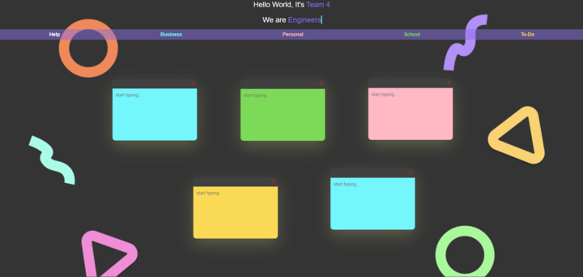
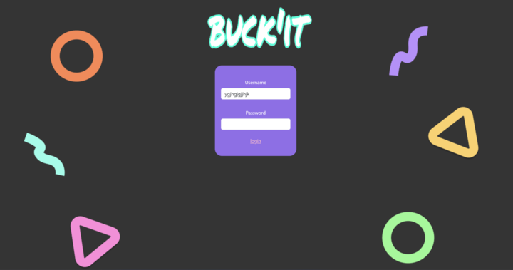

# TEAM 4- Project 1: Buck'It - Interactive to do list application

As a busy person, I want to create an app that can help me structure my day and plans securely.

## Acceptance Criteria - Features

*It's done when can access sign-in page and sign-in successfully.

*It's done when I can access a landing page to create my stickies: Personal, Business, School and Todo.

*It's done when a modal can by accessed using the "Help" and provides instructions on how to create sticky.

*It's done when I can add a task and use the corresponding color.

*It's done when i can delete a sticky, autosave by adding text to a sticky and move around the screen.

## Assets
The following image demonstrates the web application's appearance and functionality:

## Technologies used:

*HTML 
*CSS
*Javascript
*Github
*Figma

## Live Demo Link

(https://bfrausb.github.io/Buck-IT/)

## Direction for future development

*Add Calender events and reminders to sync up to e-mail

*Option to archive notes by date/year

*Ability to overlap stickies in any order

*Option to title sticky notes

*Nav bar to add options to share to social media, contact, info and help to report sign-in issues.

[def]: screenshot_2024-12-01_224403_720.png